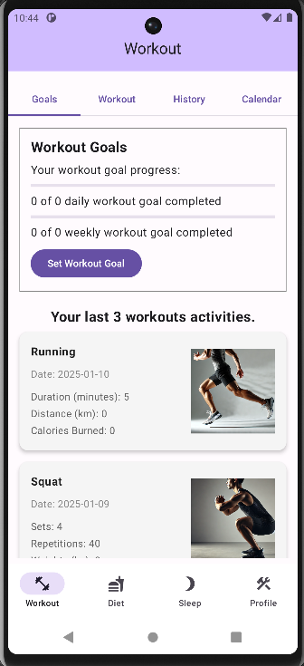
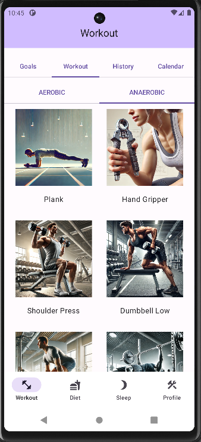
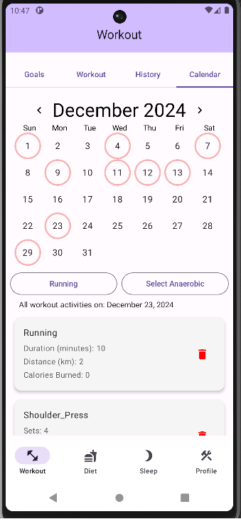
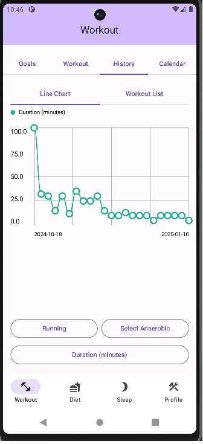
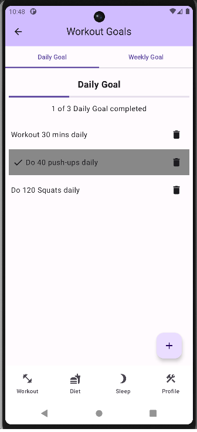

# HealthFusion

HealthFusion helps users track and manage their health efficiently, With features such as **workout tracking**, **goal setting**, and **data visualization**.

## Features

- **Workout Tracking**:
  - **Aerobic Workouts**: Log exercises like running, cycling, and walking with time, distance, and calories burned.
  - **Anaerobic Workouts**: Track strength-based exercises like push-ups and squats, including sets, repetitions, and weights.

- **Goal Setting**:
  - Create custom daily and weekly goals, like "Run 30 minutes daily" or "Do 50 push-ups weekly."
  - Create daily and weekly goals that automatically track progress based on workout activity, dynamically updating goals as workouts are completed.
    
- **Visualization**:
  - Visualize workout data using a line chart.
  - A calendar view allows users to check each workout’s date easily.

- **Login System**:
  - Secure login and sign-up with Firebase Authentication.

- **Real-Time Data Sync**:
  - Automatically sync workout data between Room Database and Firebase Firestore.
  - Supports offline mode with automatic synchronization upon network recovery.
    
## Technologies Used

- **Jetpack Compose**: Modern, reactive UI.
- **MVVM Architecture**: Clean separation of concerns.
- **Hilt**: Dependency injection.
- **Room Database**: Offline data storage.
- **Firebase Firestore**: Cloud-based data synchronization.
- **Firebase Authentication**: User authentication.
- **Coroutines + Flow**: Asynchronous programming.

## Firebase Setup

1. Follow the [official Firebase setup guide](https://firebase.google.com/docs/android/setup).
2. Configure `google-services.json` in the `app` directory.

### Firebase Authentication Sign-In Method

To use the login and sign-up system, set up the Firebase Authentication sign-in method.

1. Navigate to **Firebase Console → Authentication → Sign-in method**.
2. Enable the "Email/Password" provider.

## Firestore Security Rules Setup

To secure your Firestore database, configure Firestore Security Rules as follows to ensure only authenticated users can read and write their own data:

1. In the **Firebase Console**, go to **Firestore Database**.
2. Click on the **Rules** tab.
3. Replace the default rules with the following:

   ```javascript
   rules_version = '2';

   service cloud.firestore {
     match /databases/{database}/documents {
       
       // Allow authenticated users to read and write their own user document
       match /users/{userId} {
         allow read, write: if request.auth != null && request.auth.uid == userId;
       }

       // Allow authenticated users to read and write their own workout documents
       match /users/{userId}/workouts/{workoutId} {
         allow read, write: if request.auth != null && request.auth.uid == userId;
       }
       
       // Allow authenticated users to read and write their own diet documents
       match /users/{userId}/diets/{dietId} {
         allow read, write: if request.auth != null && request.auth.uid == userId;
       }
       
       // Allow authenticated users to read and write their own sleep documents
       match /users/{userId}/sleeps/{sleepId} {
         allow read, write: if request.auth != null && request.auth.uid == userId;
       }
     }
4. Click Publish to save the rules.

## Screenshots
    


## Future Features
- ~~**More workout options**: Different options (eg: Timer, time [minute or hour], distance [km or m])~~
- **Push Notifications**: Get workouts, meals, and sleep reminders.
- **User Profile Management**: Manage personal health goals.

## License
Distributed under the MIT License. See LICENSE for more information.
   
